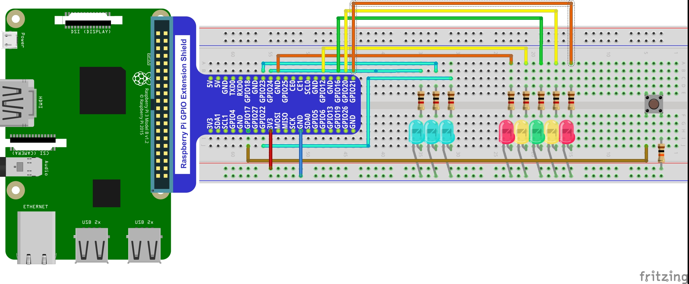

# bareMetalChaser
A simple LED based arcade-style game programmed for the pi 3+ in ARM assembly

<h2>Rules</h2>
The rules are simple. Your objective is to hit the button when the green LED is lit.
 You start with 5 lives displayed in binary on the blue LEDs.
 If you hit a yellow light, you lose 1 life.
 If you hit a red light, you lose 2 lives.
 Any time you hit the green light, your score is increased by one, and the speed of the light increases.
 Once you run out of lives, your score will be displayed in binary on the 5 main LEDs.
 To play again, hit the button once more.

<h2>How to configure your pi</h2>
First, you will need to configure a breadboard like so.

 Secondly, you will need an empty micro sd card thats been formatted to the FAT32 file system, and has the contents of the boot folder on it, as well as kernel.img.
